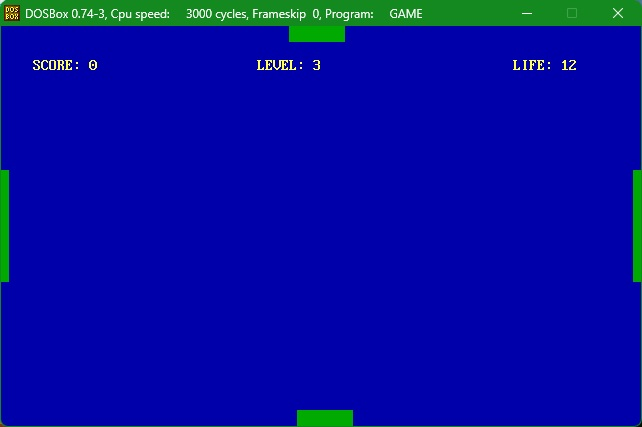

# Introduction
This game is written in Assembly Code as a tribute to the very early days of computer games. It can be run under MS-DOS.

# Overview

### Introduction:
This game allows the player to control four paddles SIMULTANEOUSLY using the mouse. The four paddles sits at the four borders of the screen. When the player moves the mouse upward, the left paddle will move downward, whereas the right paddle will move upward. When the player moves the mouse to the left, the bottom paddle also moves to the left, but the top paddle moves to the right. The player must control the paddles to catch certain “good” balls while avoiding certain “bad” balls, and there will be some special effects when catching or missing certain balls (See details below). All balls shoot out in a central region. The balls’ starting position and direction are determined by random numbers. The user can also choose different difficulty levels before starting the game. Different levels have different paddle length, ball speed, probability of bad ball appearance, ball shooting rate, starting HP and score increment. 

### Game Objective: 
The objective of this game is to use the mouse to simultaneously control the four paddles that move along the four borders of the screen. Move the paddles to catch all purple, white and green balls (They are good balls and they cost the player 1 HP if MISSED. White balls have special effects that are described in B4) and avoid all black, blue and red balls (They are bad balls and they cost the player 1 HP if CAUGHT. Blue and red have special effects that are described in B4). There is no time limit. The player can score as many points as they can. The player is defeated if HP drops to zero.
- If the player MISSES a white ball, the entire screen will be covered by white lights for a short time. The player won't be able to see what happened in this short time.
- If the player CATCHES a blue ball, the paddle that catches it freezes. It changes color to blue and can no longer move for a certain amount of time. 
- If the player CATCHES a red ball, the paddle that catches it go into confusion. It changes color to red, loses control and will move crazily for a certain amount of time. 
- After the paddle catches a blue or red ball, it can still catch any balls that hit the paddle. So it may help catch good balls (purple, white or green), but it may also catch bad balls (black, blue or purple)
- Green balls are tricky to catch. They are the AI balls introduced in the proposal. The green balls will wander near a border until it finds a good chance (that is, if the distance between the paddle guarding this border and itself is sufficiently large), then it will suddenly change its direction and charge towards the border. Only at this time is it possible to catch a green ball. But since the player has to worry about other balls, it's likely that some green balls will miss.

### Primary Interface:
Upon entering the game, the user will see four dark green paddles lying on the four borders, and the background color is blue. Purple, white, green, black, blue and red balls shoot out from a central region. The balls have different shapes. 

### Difficulties
The game has 9 difficulties:
- 1-extremely easy: normal balls only, extremely slow ball speed, very slow ball shooting rate, long paddle, 1pt per ball
- 2-very easy: tiny amount of bad balls, slow ball speed, slow ball shooting rate, long paddle, 1pt per ball
- 3-easy: small amount of bad balls, slow ball speed, slow ball shooting rate, long paddle, 1pt per ball
- 4-normal: small amount of bad balls, moderate ball speed, moderate ball shooting rate, medium paddle, 2pts per ball
- 5-hard: moderate amount of bad balls, moderate ball speed, moderate ball shooting rate, medium paddle, 3pts per ball
- 6-very hard: moderate amount of bad balls, fast ball speed, fast ball shooting rate, medium paddle, 4pts per ball
- 7-nightmare: moderate amount of bad balls, very fast ball speed, fast ball shooting rate, short paddle, 6pts per ball
- 8-inferno: large amount of bad balls, very fast ball speed, fast ball shooting rate, short paddle, 8pts per ball
- 9-mission impossible: large amount of bad balls, extremely fast ball speed, very fast ball shooting rate, very short paddle, 10pts per ball

### Game start screen

# Technical Stuff

### Overview
- Graphics: The graphics mode in this game is text mode (80 columns and 25 rows). This game tends to be more physical rather than graphical, so there's no special graphic effect.
- Sound: The game beeps when the player catches a good ball or a bad ball. The length and frequency of the beep are different between catching a good ball and catching a bad ball.
- Mouse programming: The game uses the mouse's position to determine the positions of the four paddles at the same time (Detailed instructions to control the paddles are also provided at the start of the game).
- Interrupt programming: The game uses the following interrupts:
  - int 20h: Return to DOS
  - int 33h: Get mouse's positions
  - int 16h: Get keyboard input
  - int 10h: Print characters to the screen
  - int 62h: Create random numbers
- RNG: The game uses a random number generator to create random numbers. Random numbers in this game determine the starting position of a newly created ball, starting direction of the ball and the type of the ball (first decide whether the ball is good or bad, and then decide the subtype).
- Memory management: All the global variables and constants, including arrays that store the information of balls and paddles, are at the start of the program. That is, the memory addresses of all these variables and constants are before the memory address where codes are stored. 

### Summary of Assembly Modules:
- reset_game: restore all the global variables for the player to play this game again
- init_welcome: welcome the player and initialize the game. 
- update_paddle: updates each paddle’s position and bad-status timer. 
- create_ball: creates balls at a certain rate and for each ball, determine its position, direction and ball type. 
- update_balls: updates all the balls’ positions present in the interface. It also deals with ball collision with paddles, deleting balls and handing the special AI balls (green balls)
- paint_field, paint_blink, paint_paddle and paint_balls: they serve to paint the game interface according to the global variables
There are some sub procedures in each of the procedure described above. For details, please refer to the source code.   
